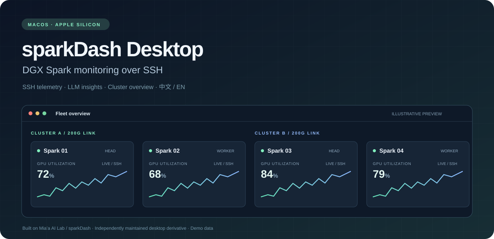

# sparkDash Desktop

[简体中文](README.zh-CN.md) | **English**



<p align="center">
  
  
  
  
  <a href="LICENSE"></a>
</p>

A desktop application for monitoring NVIDIA DGX Spark and remote Linux NVIDIA GPU hosts over SSH. Based on [sparkDash by Mia’a AI Lab](https://github.com/MiaAI-Lab/sparkDash), with an Electron desktop runtime, local SSH configuration support, protected credential storage, and English / Simplified Chinese interfaces.

## Features

| Area | Capabilities |
| --- | --- |
| Fleet monitoring | Overview and per-host GPU, CPU, memory, storage, network and uptime; DGX shared memory and dedicated GPU VRAM displayed separately |
| LLM services | Multiple ports; detection of llama.cpp, vLLM, SGLang, ds4-server, EXL3, q27 and TensorFold; token statistics and available inference metrics |
| Benchmarks and demos | Decode / Prefill benchmarks, TTFT, saved results, text/image sharing and streaming Prompt Showcase |
| Optional services | ComfyUI queues and progress, Hermes status and explicit updates, Tailscale status |
| Desktop integration | Native menus, four themes, live language switching, local SSH alias import, key/password authentication, service tunnels and sleep/wake cleanup |
| Cluster overview | Head/Worker grouping and direct-link 200G network discovery for 2–12 saved Sparks, plus optional pairwise TCP and RDMA Write bandwidth tests |
| Device operations | Single-device and batch shutdown/reboot through system commands, separate optional encrypted sudo credentials, and Wake-on-LAN |

The monitoring UI, collectors, service integrations and inference benchmarks come from upstream sparkDash. This version adds desktop menus, local SSH configuration import, English / Chinese switching, cluster grouping, and bandwidth / RDMA tests. See the [feature matrix](docs/upstream-feature-matrix.md) and [acknowledgements](ACKNOWLEDGEMENTS.md).

## Power operations and sudo credentials

Shutdown and reboot execute fixed `sudo systemctl poweroff` / `sudo systemctl reboot` commands over SSH. No `spark-shutdown` helper is required. The target must provide systemd and sudo authorization for the requested command; the app does not install tools, change sudoers, or override shutdown inhibitors.

Use each device's **Sudo authentication** entry to verify and save an independent sudo password, or forget it. Power confirmation dialogs also accept a password for one use. Saved credentials use the existing AES-GCM store with a macOS Keychain-protected key. Passwords never enter device configuration, API responses, command arguments or logs. Changed SSH host/user/port settings do not reuse a previous sudo credential.

Preflight checks general sudo authentication; the target's policy still decides whether the actual power command is allowed. Policies allowing only individual commands without passwords may still require a password at preflight. Batch operations address the online devices shown in confirmation and report each result. A successful request is not proof that hardware powered off or rebooted. Commands refused by sudo or systemctl are reported as rejected; interrupted connections and timeouts remain unconfirmed and are not retried automatically. WoL remains a separate UDP operation.

## Install and connect

1. Extract the macOS app archive and move `sparkDash.app` into Applications. To build it yourself, follow [Development](#development) to install dependencies, then run `pnpm package:mac`.
2. Launch the app and add a device. Import an alias from your local SSH configuration or enter its address manually. Leaving username, port and private key blank inherits the SSH configuration, including supported `Include` files.
3. Select **Test SSH connection**. If key authentication fails, use **Use password instead** to retry. Testing does not save the device or password; **Save** persists them.
4. Set the ports of services already running on the device, or disable unused service monitoring. The default LLM port is `8888`; ComfyUI defaults to `8188`.
5. Choose **Language → English / 简体中文** in the native menu, or change the language in Settings. The preference survives restarts; first launch defaults to English.

## Clusters and network tests

### Create a cluster group

From Overview, use **Detect 200G / Create cluster** to inspect saved SSH targets, select a group and assign its Head. Groups can later be edited or dissolved. Saving roles organizes monitoring; it does not deploy an inference cluster.

A green network result means bidirectional IPv4 probing succeeded over directly connected interfaces negotiating at least 200 Gb/s. This indicates link status; use the bandwidth tests below to measure actual throughput. Routed paths, missing addresses and failed probes remain unverified. See [NVIDIA’s clustering guide](https://docs.nvidia.com/dgx/dgx-spark/spark-clustering.html) for network setup.

### Test bandwidth and RDMA

1. Choose **Bandwidth / RDMA test** on a cluster card.
2. Select two devices, click **Find network paths**, then choose the path to test.
3. Select TCP bandwidth, RDMA Write, or both, and click **Start network test**.

| Test | Required on both devices | Result |
| --- | --- | --- |
| TCP bandwidth | `iperf3` | Measured receiver throughput |
| RDMA Write | Matching `ib_write_bw` versions and configured, active RoCE v2 interfaces | Average write bandwidth using host memory |

Each test runs for 10 seconds in each direction and reports Gb/s for the selected path only. Missing tools or unmet prerequisites are reported in the dialog. RDMA tests do not exercise GPU Direct, NCCL or model inference.

Tests consume network bandwidth, so run them when the cluster is idle. Click **Stop network test** to cancel. Closing the dialog leaves the test running; reopen it to view progress and results. Only one network test job can run at a time. Results remain available until the next test or backend restart.

## Data, credentials and updates

Application data lives in `~/Library/Application Support/sparkDash`; open it from **Monitor → Open data directory**. SSH aliases and key-only connections do not access Keychain. Saving passwords/API keys, or reading existing encrypted credentials, requests access to **sparkDash Safe Storage**. The system dialog accepts your login keychain password; the app does not receive it. Saved passwords and API keys are encrypted, with the encryption key protected by macOS Keychain.

To update, quit the app and replace the application bundle. Back up the complete data directory after quitting, and retain the previous app. To roll back, restore both the previous app and its matching data backup. Encrypted data may not be decryptable under another Mac/user; preserve `secrets-key.encrypted` with the encrypted data.

Closing the last window exits and stops sampling. Sleep pauses monitoring; wake establishes new connections and rate baselines. Short charts live in window memory; long-term LLM statistics and inference benchmark results persist. Sampling gaps are not backfilled. If credentials cannot be unlocked, preserve the files and retry using **Monitor → Reconnect backend**. Fleet membership changes may also require reconnecting to start a new energy sampling group.

## Project layout

```text
src/          React + TypeScript UI, API clients, shared types and i18n
server/       Express / WebSocket backend, collectors, registry and statistics
desktop/      Electron main/preload, backend lifecycle, SSH and credential bridge
scripts/      Packaging and local / hardware acceptance checks
config/       Browser/server-mode defaults and helpers
assets/       Application assets
docs/         Architecture, feature matrix, verification and research
```

`node_modules/`, `.pnpm-store/`, `dist/`, `release/` and `.desktop-test/` are generated local directories and are ignored by Git. Runtime configuration and secrets are excluded; `config/settings.json` is the tracked default settings file. Use the pnpm lockfile for reproducible dependency resolution.

## Development

The current desktop development and packaging workflow uses macOS, Node.js **24.19+**, and **pnpm 11.25.0**. Commands run from the repository root:

```sh
pnpm install --frozen-lockfile
pnpm typecheck
pnpm test
pnpm build
pnpm desktop
```

`pnpm desktop` loads the built frontend, so rebuild after frontend edits. For browser-based frontend/backend development, use `pnpm dev` (Vite `5173`, backend `5555` by default); it does not provide all native desktop behavior.

| Command | Purpose |
| --- | --- |
| `pnpm typecheck` | TypeScript checks |
| `pnpm test` | Backend, frontend and desktop integration suites |
| `pnpm test:server` / `pnpm test:frontend` / `pnpm test:desktop` | Run one suite |
| `pnpm build` | Build frontend into `dist/` |
| `pnpm package:mac` | Build frontend and package/sign the ARM64 app |
| `pnpm test:packaged` | Exercise the built app with isolated local fixtures |

Packaging produces `release/sparkDash-darwin-arm64/sparkDash.app`. Further development notes, test scripts and verification records are listed in the [documentation index](docs/README.md).

## License and upstream credit

The desktop application is MIT-licensed; the original [LICENSE](LICENSE) is retained unchanged. The source baseline is **MiaAI-Lab/sparkDash 1.8.9**, commit [`b4228a330a7877dcb5a30516500d57e26affa45a`](https://github.com/MiaAI-Lab/sparkDash/tree/b4228a330a7877dcb5a30516500d57e26affa45a). Thank you to **Mia’a AI Lab and upstream contributors** for the dashboard and monitoring foundation.

Dependencies retain their respective licenses. See [ACKNOWLEDGEMENTS.md](ACKNOWLEDGEMENTS.md) for exact sources and license scope. This is an independently maintained derivative and does not represent or imply endorsement by Mia’a AI Lab or NVIDIA.
