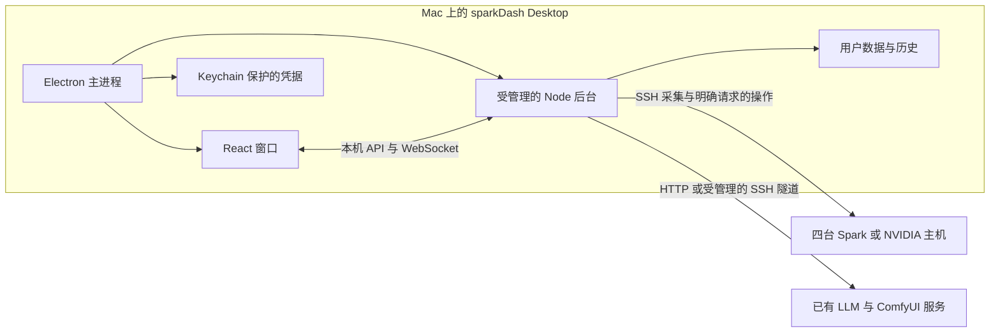

# sparkDash Desktop 桌面实施计划

核查日期：2026年10月4日。此文是实施提案，尚未开始桌面工程开发。基线为上游提交 `b4228a330a7877dcb5a30516500d57e26affa45a`，`package.json` 与 README 均标示 `1.8.9`。完整能力范围见 [功能矩阵](upstream-feature-matrix.md)，需求与操作边界见 [项目交接](project-handoff.md)。

建议第一阶段交付一个可以从 Finder 启动、保留上游页面结构、自动管理本地后台的 Mac `.app`，先通过模拟设备验收。随后接一台真实设备做只读验证，再扩展四台和全部远程操作。分阶段安排不缩减最终迁移范围。

## 推荐架构

优先评估 Electron，沿用 React 界面和 Node/Express/WebSocket 后台，减少重写功能的范围。主进程管理窗口、凭据、后台进程和休眠唤醒；后台优先尝试 `utilityProcess.fork`。Electron 官方将其定义为带 Node.js 和消息端口的子进程机制，是否兼容上游 ESM、依赖和打包路径仍须原型验证。[utilityProcess 文档](https://www.electronjs.org/docs/latest/api/utility-process)

这个架构没有远端新增常驻 agent。App 退出或 Mac 休眠会中断采样；网络连接恢复后不能补出未采集的数据。

上游已经包含特定 Mac 主机的 launchd 部署样例，但依赖固定用户路径、外部 Node/npm，并在启动脚本内修复依赖和构建前端。它们是现有运维部署资料，不能直接作为本项目的桌面入口，也不应带入样例主机配置。[部署样例][S-deploy]、[启动脚本][S-guard]

## 源码决定的适配工作

以下“当前事实”均为固定提交的静态核查；“改造”均为未实施提案。

| 领域 | 当前事实与证据 | 桌面改造及验收重点 |
| --- | --- | --- |
| 后台生命周期 | `server/index.js` 导入时创建 registry、服务和计时器，启动监听后启动 monitor；SIGINT/SIGTERM 路径保存部分历史、停止采集并 `process.exit`。[入口][S-index] | 提取可注入配置的 `start/stop` 服务边界，CLI 入口和桌面入口复用；后台 ready 后再显示主界面。退出、崩溃、重复启动和后台重启都检查遗留进程与在途任务。 |
| 端口与本地鉴权 | 默认 `127.0.0.1:5555`；loopback GET 即使配置 token 仍跳过鉴权。`allowOpenRemote()` 缺省为 true，与 README 的非本机无 token 拒绝启动说法不一致。[鉴权][S-auth]、[预检][S-preflight] | 桌面固定 loopback，申请空闲端口并回传实际地址。每次启动建立本地会话凭据，覆盖全部数据/操作 API 和 WS，校验 Host/Origin；不把 token 写入 URL 或长期 localStorage。浏览器 WS 不能直接自定义 Authorization，须实现并测试会话 cookie 握手或受限 preload 消息桥。 |
| Linux 本机假设 | `isLocal` 会选择本机采集、Hermes 本机执行和本机关机；预检检查 `/host/proc`、sysfs 及单个默认私钥。[预检][S-preflight]、[入口][S-index] | 新增显式桌面运行模式，UI 与后端都拒绝 Linux local 节点；导入旧配置时标出并转换/补全远程目标。预检按实际设备和认证能力运行，不能提示用户在 Mac 安装 `/proc`。 |
| SSH | `execFile` 参数数组、系统 `ssh`、可选 `sshpass -e`；使用 `SSH_AUTH_SOCK`、全局 `SSH_IDENTITY_FILE`、`accept-new` 主机密钥策略和连接复用。[SSH 实现][S-ssh] | 使用确定的系统 SSH 路径，验证 Finder 环境中的 agent；支持每节点身份/端口和 known_hosts。明确首次主机密钥信任与变更提示。密码方式选择随包可用的 helper/askpass 实现，不能以要求用户安装 Homebrew 为日常前提。现有 sshpass 探测与实际执行路径需统一。 |
| HTTP 与隧道 | Decode/Prefill 的已保存节点能从直连回退到 SSH local-forward；常规 LLM/Comfy 探测用 `llmProbeHost`，没有因此自动共享基准测试隧道。[隧道][S-tunnel]、[目标解析][S-host] | 提供统一的按节点/服务/端口分配连接的接口，覆盖常规轮询、Showcase、Comfy HTTP/WS、取消和外部打开。共享隧道用引用计数，测试取消一个任务不会断开仍在监控的服务。 |
| 存储 | 多个模块默认写源码目录下 `config/`，并各有环境变量覆盖；主题及界面状态使用浏览器存储。[配置][S-config]、[设置][S-settings] | 在任何后台模块导入前注入独立用户数据目录，资源目录只读。统一迁移、原子写入、坏文件备份及版本号；不将配置/历史写进 `.app` 或依赖启动 cwd。随机端口会改变页面 origin，要迁移主题等偏好到稳定存储。 |
| 凭据 | 上游 SSH 密码和按端口 LLM API key 使用 AES-GCM，默认密钥文件与密文都位于 config；公共 API 有脱敏接口。[凭据][S-secrets] | 保留脱敏契约，以 Mac Keychain 保护密钥/凭据；可评估 Electron `safeStorage`，它是 OS 保护的加密接口，密文仍需本地保存。拒绝访问、锁定、旧格式迁移和 App 签名改变均需验证。[safeStorage 文档](https://www.electronjs.org/docs/latest/api/safe-storage) |
| 任务与恢复 | 上游退出处理会中断基准任务并保存终态，SSH 复用主连接可能按 ControlPersist 继续存活。[入口][S-index]、[SSH 实现][S-ssh] | 后台停止时取消采集、关闭流、隧道与复用连接，等待退出后限时清理自身进程。崩溃恢复记录“中断/状态待确认”，不自动重试压测、关机、取消或更新。 |
| Hermes 检查副作用 | 公共命令包装器会先删除 Hermes Git 锁文件，检查/更新预览路径涉及 `git fetch`。[Hermes 实现][S-hermes] | 先拆分纯状态查询、联网检查和实际更新；移除后台自动清锁。首次只读设备验证不启动原样 Hermes 检查器。保留最终 Hermes 功能，显式呈现动作含义。 |
| 数据质量 | 存在缺值转 0、缓存和估算路径；日常速率、累计统计和能耗各有不同基线。[系统采集][S-system]、[功能矩阵](upstream-feature-matrix.md) | 指标带 `observedAt`、有效/未知/过期状态及来源。休眠/掉线时保留缺口，唤醒后重建速率基线。GB10 的 GPU 进程内存和 CPU 剩余量标为估算。 |

渲染进程保持隔离与沙箱，不给页面 Node 权限；preload 只暴露必要动作，并验证 IPC 调用来源。ComfyUI 等外部页面交给系统浏览器，校验 URL 协议和目标，不在有权限的应用窗口内加载远端内容。这些选择遵循 Electron 官方安全建议，仍需在具体实现中验证。[Electron 安全文档](https://www.electronjs.org/docs/latest/tutorial/security)

休眠唤醒使用 Electron `powerMonitor` 的相关事件；事件用于停止与重建连接，不保证能在系统强制休眠前完成所有异步保存。周期性落盘和启动恢复必须独立成立。[powerMonitor 文档](https://www.electronjs.org/docs/latest/api/power-monitor)

## 存储迁移清单

建议以 `app.getPath('userData')` 为用户状态根目录，以独立日志目录保存脱敏日志；具体 App ID 和名称稳定后再固定实际目录。资源使用打包后的资源路径，不以当前工作目录推算。[Electron app 路径 API](https://www.electronjs.org/docs/latest/api/app#appgetpathname)

| 上游入口 | 需迁移的状态 |
| --- | --- |
| `SPARKS_JSON_PATH`、`SETTINGS_JSON_PATH` | 设备清单、角色、服务端口、排序、全局设置 |
| `SPARKS_SECRETS_PATH`、`SECRETS_KEY_PATH` | SSH 密码和按端口 LLM key 的旧格式导入；新保存方式由桌面凭据层管理 |
| `GPU_MEMORY_JSON_PATH` | GPU 内存辅助文件路径；Mac 远程模式不把本机旧文件当作远端实时数据 |
| `LLM_DAILY_JSON_PATH`、`LLM_TOKEN_JSON_PATH` | LLM 日峰值与累计 token 状态；分别保留原有时间和重置语义 |
| `FLEET_ENERGY_JSON_PATH` | 能耗估算、覆盖率和拓扑相关状态 |
| `BENCH_HISTORY_PATH`、`BENCH_ACTIVE_PATH` | Decode 的已保存结果和在途状态 |
| `PREFILL_BENCH_HISTORY_PATH`、`PREFILL_BENCH_ACTIVE_PATH` | Prefill 的已保存结果和在途状态 |
| `SHOWCASE_HISTORY_PATH` | Showcase 保存结果 |
| `localStorage` 等浏览器状态 | 主题、界面偏好；桌面会话 token 不沿用永久保存方式 |

路径证据：[统一配置][S-config]、[设置][S-settings]、[Decode][S-decode]、[Prefill][S-prefill]、[Showcase][S-showcase]。存储重定向不等于增加长期时序数据库；上游短期曲线和跨启动持久历史的具体差异保留在功能矩阵中。

## 实施顺序与完成标准

### 第一阶段 本地桌面运行闭环

前置条件：不需要四台设备的地址或凭据。建议按以下顺序实施，每一步的结果可以单独验收。

1. **建立开发基线。** 在新项目初始化 Git 并引入固定提交，保留 MIT LICENSE、上游出处与变更基线；原始文件与桌面改动分开记录。过滤仅服务原作者环境的部署样例，空设备清单启动。记录导入方式以便以后同步上游。
2. **核对依赖与运行时。** 先验证锁文件能安装、上游类型检查/测试/构建能执行，再选择兼容的 Electron 版本与打包工具。锁文件中的运行时 `undici 8.9.0` 要求 Node `>=22.19.0`，不能仅凭本机 Node 版本认定 Electron 内置 Node 可用。构建工具要求另外核对。[package 与脚本][S-package]、[锁文件][S-lock]
3. **提取后台服务边界。** 引入 `start/stop`、运行模式、资源/数据路径、端口和就绪消息；为采集和远端操作注入替代实现。测试启动失败、停止和重启，不在测试时自动发现或连接真实设备。
4. **搭建 Electron 主进程与窗口。** 实现单实例、受管理的 Node 后台、启动失败页面、loopback 接口会话保护。保留上游 Overview、详情、设置和服务页面结构；以四台明确标为模拟的节点检查正常/离线/GPU 未知/服务不可达四种状态。
5. **迁移本地状态。** 所有写入进入用户数据目录；主题在后台端口变化后仍保留。接入凭据层并验证脱敏，真实凭据不进入测试文件、日志或源码仓库。
6. **实现停止与恢复。** 提议首版关闭最后一个主窗口即退出并停止采样，避免隐形后台；明确区分最小化。验证 Cmd+Q、后台崩溃、休眠/唤醒、重复点击 App，及打开外部网页后的隧道清理。若后续增加菜单栏常驻，应单独定义可见状态。
7. **产出内部 Mac 安装包。** 检查用户 Mac 架构后打包对应 `.app`，并在终端未启动 Node/Docker 的情况下从 Finder 启动。内部包的签名/公证状态如实记录，不把开发启动命令当作交付。

**本阶段完成标准：** 本地 `.app` 可独立启动完整页面结构；四台模拟节点的配置增删改和数据状态正确；重启保留状态；无端口冲突、无 App 内写入、无退出残留采集；跨 origin 请求不能调用本地数据或操作 API。所有模拟操作可追踪且不会落到真实 SSH/HTTP 目标。

### 第二阶段 一台只读接入并扩展四台

依赖第一阶段完成，再由用户提供设备连接信息。先连接一台已知可用设备，验证系统 SSH 的密钥/agent/密码方式、非默认端口、主机密钥变化和断线恢复。采集命令先逐条审阅，Hermes 原样检查器不进入只读路径。

对照同一时段的 `/proc/meminfo`、`nvidia-smi`、CPU/网络/磁盘计数，核对单位、采样间隔和失败状态，再扩展到四机并发。至少包含 GB10 整卡内存不支持、GPU 进程内存不可读、驱动故障、整机离线和休眠后首个样本；确保设备间基线与历史不串用。普通独显/多 GPU 先保留模拟回归，未实测时明确标注。

**完成标准：** 用户四台的已授权只读监控可持续运行和重连；GPU 不可用的节点仍可准确显示主机在线；SSH 和服务连接状态分开表示。原运维故障不要求本项目修好。

### 第三阶段 LLM 和 ComfyUI 监控路径

依赖统一连接接口，逐端口验证常规 LLM 探测、后端识别、API key、日峰值、累计 token 和后端健康指标；用伪服务覆盖不同后端，在真实已部署后端上核对字段与单位。未部署的后端不标为实机通过。

ComfyUI 验证队列、模型/LoRA、HTTP/WS、真实进度与估计进度的区别，以及通过隧道打开原页面。此阶段只读；不提交工作流或取消已有任务。能耗卡明确仅为估算，解决节点增删后的 `restartRequired` 行为与非 Spark 主机适用性。

**完成标准：** HTTP 直连与仅 SSH 可达的服务均有清晰路由状态；多个端口与多个节点之间的凭据、连接和统计隔离；不支持的健康字段显示不可用。

### 第四阶段 基准测试与远端操作

先用本地伪服务验证 Decode、Prefill、Showcase 全流程和文字/图片分享，再在用户指定的空闲服务与范围内运行真实请求。检查并发预算、长上下文超时、首 token 指标、取消、断网、休眠、退出和历史恢复。临时目标白名单通过 App 可管理配置实现，避免依赖用户在终端设置环境变量。

关机、WOL、ComfyUI 取消、Hermes 更新分别验证，不能因为 SSH 通就宣布可用。保留逐台结果与确认目标，恢复时不自动重复动作。Hermes 检查和更新先完成副作用拆分；关机只调用已配置的正常关机机制，不自行安装脚本或修改 sudoers；WOL 单独记录设备与网络条件。

**完成标准：** 每项操作都有自己的成功、失败、取消和状态待确认用例及记录；批量操作不把部分成功汇总为全成功；没有拿真实繁忙设备代替测试桩。

### 第五阶段 分发与完整迁移验收

固定 App ID、最低 macOS 与目标架构，完成签名/公证方案、安装升级/回退和凭据迁移，确认无需外部 Node、Docker 或临时下载依赖。用干净用户环境验证 Finder 启动、密钥访问、网络权限、日志脱敏、四机运行和休眠恢复。

按功能矩阵逐行填写实际验证记录。尚未验证的硬件、后端或网络条件明确列出；只有满足全部范围或经用户明确接受的差异，才称为完整桌面迁移。应用自动更新不是本次已承诺功能，发布渠道确定后另行规划。

## 验证记录与当前状态

建议后续每次验收记录：构建提交、上游基线、Mac 架构/系统版本、测试类型、节点匿名标识、服务版本、网络方式、执行结果、日志/截图和仍未覆盖项。不要记录密码、私钥、Bearer token 或完整敏感提示词。

导入后的基础检查命令为 `npm run typecheck`、`npm run test:server`、`npm run test:frontend`、`npm run build`，来自当前上游 package scripts；桌面生命周期、鉴权和打包冒烟测试需要新增。命令在本文中是待执行计划，本次未安装依赖或运行测试。

当前已完成：空目录/指令检查、原交接资料读取、固定提交源码核查、本地文档整理，以及上游应用源代码、测试和构建文件的导入；保留原 LICENSE，原 README 位于 `docs/upstream/README.md`。当前 Mac 已检查为 ARM64。Git 初始化因目录权限限制尚未完成；尚未安装依赖或运行测试，尚未实现桌面壳层、Mac 包或进行实机验收。

启动前评估：没有必须由用户先决定的阻塞性产品问题。技术与界面行为暂按本计划的可调整默认方案实施。用户表示将随后通过 `/goal` 启动完整实现；当前停在准备阶段，未启动任何远端连接或操作。

开始第二阶段前才需要设备别名、地址、SSH 用户与端口、认证方式、可达网络和已有服务端口；首台只读验证优先使用健康设备。凭据通过本地凭据界面或既有 SSH 配置提供，不保存到这些交接文档。

[S-index]: https://github.com/MiaAI-Lab/sparkDash/blob/b4228a330a7877dcb5a30516500d57e26affa45a/server/index.js
[S-auth]: https://github.com/MiaAI-Lab/sparkDash/blob/b4228a330a7877dcb5a30516500d57e26affa45a/server/auth.js
[S-preflight]: https://github.com/MiaAI-Lab/sparkDash/blob/b4228a330a7877dcb5a30516500d57e26affa45a/server/startupPreflight.js
[S-ssh]: https://github.com/MiaAI-Lab/sparkDash/blob/b4228a330a7877dcb5a30516500d57e26affa45a/server/collectors/ssh.js
[S-tunnel]: https://github.com/MiaAI-Lab/sparkDash/blob/b4228a330a7877dcb5a30516500d57e26affa45a/server/collectors/llmTunnel.js
[S-host]: https://github.com/MiaAI-Lab/sparkDash/blob/b4228a330a7877dcb5a30516500d57e26affa45a/server/collectors/llmHost.js
[S-config]: https://github.com/MiaAI-Lab/sparkDash/blob/b4228a330a7877dcb5a30516500d57e26affa45a/server/config.js
[S-settings]: https://github.com/MiaAI-Lab/sparkDash/blob/b4228a330a7877dcb5a30516500d57e26affa45a/server/settings.js
[S-secrets]: https://github.com/MiaAI-Lab/sparkDash/blob/b4228a330a7877dcb5a30516500d57e26affa45a/server/secretsStore.js
[S-system]: https://github.com/MiaAI-Lab/sparkDash/blob/b4228a330a7877dcb5a30516500d57e26affa45a/server/collectors/SystemCollector.js
[S-hermes]: https://github.com/MiaAI-Lab/sparkDash/blob/b4228a330a7877dcb5a30516500d57e26affa45a/server/collectors/HermesProbe.js
[S-decode]: https://github.com/MiaAI-Lab/sparkDash/blob/b4228a330a7877dcb5a30516500d57e26affa45a/server/collectors/DecodeBench.js
[S-prefill]: https://github.com/MiaAI-Lab/sparkDash/blob/b4228a330a7877dcb5a30516500d57e26affa45a/server/collectors/PrefillBench.js
[S-showcase]: https://github.com/MiaAI-Lab/sparkDash/blob/b4228a330a7877dcb5a30516500d57e26affa45a/server/collectors/ShowcaseManager.js
[S-package]: https://github.com/MiaAI-Lab/sparkDash/blob/b4228a330a7877dcb5a30516500d57e26affa45a/package.json
[S-lock]: https://github.com/MiaAI-Lab/sparkDash/blob/b4228a330a7877dcb5a30516500d57e26affa45a/package-lock.json
[S-deploy]: https://github.com/MiaAI-Lab/sparkDash/blob/b4228a330a7877dcb5a30516500d57e26affa45a/deploy/ai.onyx.sparkdash.plist
[S-guard]: https://github.com/MiaAI-Lab/sparkDash/blob/b4228a330a7877dcb5a30516500d57e26affa45a/scripts/ensure-runtime.sh
